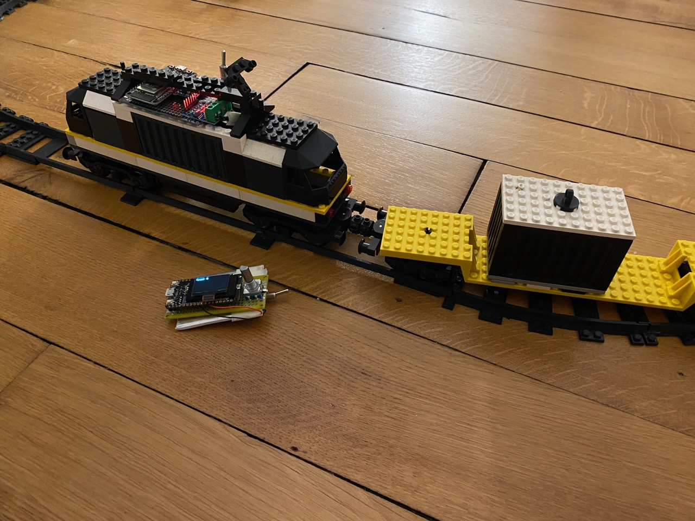

# my own lego-like rc train

repository of arduino code for rc functionalities of my rc lego train, and of openscad code for 3d printed parts of my rc lego train

code for the remote and receiver (using esp-now) are in src folder

code for parts in parts folder
